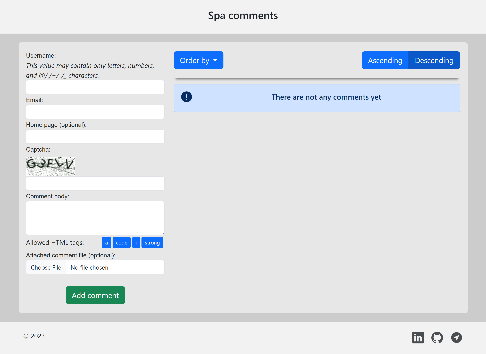

_Це лендінгова сторінка для залишення коментарів. Користувачі можуть додавати коментарі з різними допоміжними функціями, і всі введені коментарі зберігаються в реляційній базі даних (БД), включаючи дані користувача для ідентифікації._

## Демонстрація

<p></p>

## Модулі проекту

<a href='https://pypi.org/project/Django'></a> <a href='https://pypi.org/project/django-simple-captcha'></a> <a href='https://pypi.org/project/mysqlclient'></a> <a href='https://pypi.org/project/Pillow'></a> <a href='https://pypi.org/project/python-dotenv'></a> <a href='https://pypi.org/project/pytz'></a> 

## Допоміжні функції

- Користувачі можуть залишити коментарі з такими полями:
  1. Ім'я користувача (буквено-цифрові символи) - необхідне поле.
  2. Електронна пошта (формат електронної пошти) - необхідне поле.
  3. Домашня сторінка (формат URL) - необов'язкове поле.
  4. Captcha (буквено-цифрові символи) - зображення та необхідне поле.
  5. Текст (Основне текст повідомлення) - необхідне поле. Теги HTML, за винятком дозволених, не допускаються.

- Основна сторінка програми має такі вимоги:

  1. Коментарі можуть мати кілька відповідей (каскадний вид).
  2. Коментарі на верхньому рівні (не відповіді) відображаються у форматі таблиці з можливістю сортувати на наступні поля: ім'я користувача, електронна пошта та дата додавання (як у порядну зростання, так і у спадання).
  3. Відображення 25 коментарів на сторінці.

- JavaScript:
  1. Валідація вхідних даних на стороні сервера та клієнта.
  2. Панель з кнопок для тегів HTML (`[i]`, `[strong]`, `[code]`, `[a]`).

- Обробка файлів:

  1. Користувачі можуть додати зображення або текстовий файл до свого коментаря.
  2. Зображення пропорційно змінюється на максимальний розмір 320x240 пікселів, якщо завантажене зображення більше. Дозволені формати файлів - це JPG, GIF та PNG.
  3. Текстові файли не повинні перевищувати розміром 100 кб, а єдиний дозволений формат - TXT.
  4. Попередній перегляд файлів включає візуальні ефекти (наприклад, [Lightbox2](https://lokeshdhakar.com/projects/lightbox2/)).

- Регулярні вирази:

  1. Користувачі можуть використовувати наступні дозволені теги HTML у своїх повідомленнях: `<a href="" title=""> </a> <code> </code> <i> </i> <strong> </strong>`.
  2. Існує перевірка, щоб забезпечити належне закриття тегів.

## Технології та інструменти

Проект використовує такі технології та інструменти:

-   Backend:
    -   Мова програмування Python (OOP);
    -   Django фреймворк з django-simple-captcha розширенням;
    -   MySQL база данних (Django ORM).
-   Frontend:
    -   HTML & CSS;
    -   JavaScript;
    -   Bootstrap 5.
- Git для контролю версій.

## Змінні середовища

Для запуску цього проекту вам потрібно буде додати такі змінні середовища:

`SECRET_KEY`
`DB_HOST` `DB_NAME` `DB_USER` `DB_PASSWORD`

> Подивіться на file_env_example.txt

## Getting Started

Щоб розпочати проект, виконайте ці кроки:

1. Клонуйте проект:
    ```
    git clone https://github.com/Gubchik123-NURE/Spa-comments.git
    ```

2. Перейдіть до каталогу проекту:

    ```
    cd Spa-comments
    ```

3. Встановіть необхідні залежності:
    ```
    pip install -r requirements.txt
    ```

4. Налаштуйте зїєднання та конфігурації бази даних відповідно до вибраного двигуна БД. Застосуйте міграції
    ```
    python manage.py migrate
    ```

5. Запустіть сервер розробки Django:
    ```
    python manage.py runserver
    ```

    > **Примітка:** Не забувайте про змінні середовища

6. Відкрийте свій веб-браузер за адресою `http://127.0.0.1:8000` (або відповідна URL-адреса на основі вашої конфігурації Django).

## Висновок

"Spa comments" - це веб-додаток, багатий на функції, побудована за допомогою Django, JavaScript та MySQL. Це дозволяє користувачам залишати коментарі з різними параметрами, забезпечує перевірку даних та безпеку? та забезпечує зручний для користувачів інтерфейс з інтерактивними елементами.
